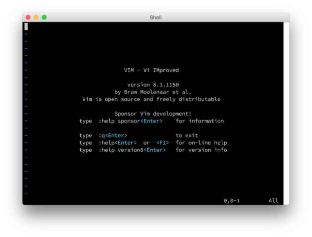

Vim
===
https://github.com/pwlandoll/vim-lightning-talk

---

What is Vim?
------------

@ul[spaced]
- Text Editor
- Terminal-based
- Extensible
@ulend

---

What is Vim *not*?
------------------

@ul[spaced]
- IDE
- Inescapable Prison
- Only for l33t h4x0rs
@ulend

---

*Why* Vim?
----------

@ul[spaced]
- Terminal-based
- Customizable
@ulend

---

*Vim*

---

Modes
-----

@ul[spaced]
- Normal
- Insert
- Visual
@ulend

---

Where to start?
---------------

`vimtutor`

---

`:q`
----

Questions?
